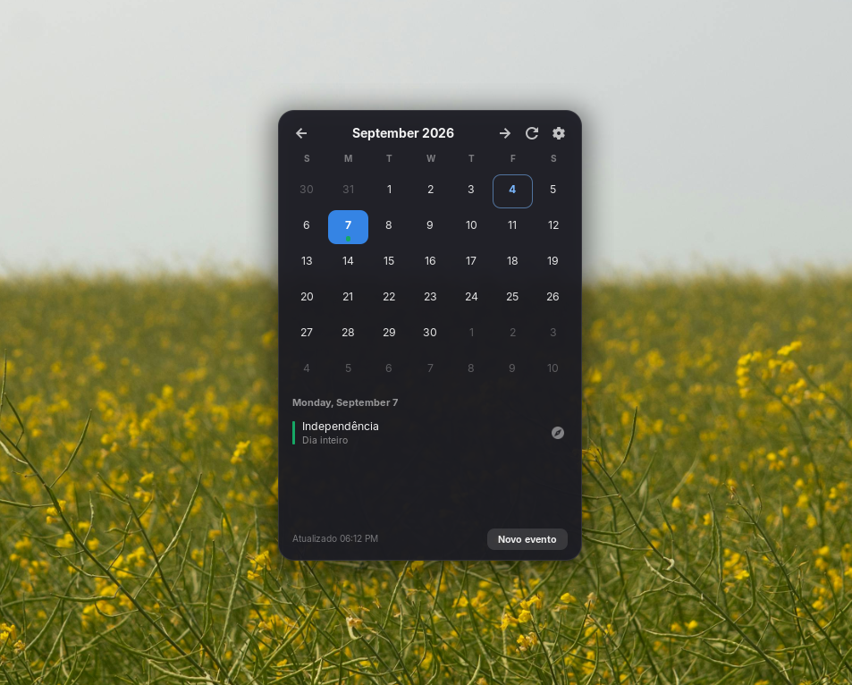

# GCalendar Widget

*[Leia em português](README.pt-BR.md)*

A desktop calendar widget for GNOME, integrated with Google Calendar.

It shows the month, marks the days that have events, lists the selected day's
events, and lets you create, edit and delete events without leaving the desktop.

> **No credentials required.** It uses the account you already have in
> *Settings → Online Accounts*. No client ID, no client secret, no sign-in
> screen, and no token stored by the extension.



## Requirements

| | |
|---|---|
| GNOME Shell | 46 or 47 |
| Online Accounts | a Google account with **Calendar** enabled |

Tested on Zorin OS 18.1 (GNOME Shell 46, GJS 1.80), X11 session.

## Installing

### From the extensions website

[](https://extensions.gnome.org/extension/10866/gcalendar-widget/)

### From source

```bash
git clone https://github.com/pvss-dev/gcalendar.git
cd gcalendar
./install.sh
```

The script runs the test suite before installing and aborts if anything fails.
Then reload GNOME Shell:

* **X11:** `Alt+F2` → `r` → `Enter`
* **Wayland:** log out and back in

And enable it:

```bash
gnome-extensions enable gcalendar@pvss.dev.br
```

## Connecting your account

1. **Settings → Online Accounts → Google**, and sign in
2. Leave **Calendar** enabled
3. That's it — the widget picks it up and syncs on its own

If you already use Google on GNOME, there is no setup at all: the widget just
works.

## Features

* Month navigation, with the selected day following along
* Coloured markers on days with events, using each calendar's colour
* Day event list with time, location, and multi-day events
* Create, edit and delete events
* Automatic sync on a configurable interval
* Notifications for upcoming events
* On-disk cache, so the widget isn't empty when offline
* Multiple Google accounts shown together
* Drag by the header, position saved automatically
* Right-click context menu

## How authentication works

The extension gets its access token from **GNOME Online Accounts**, through the
`org.gnome.OnlineAccounts.OAuth2Based` D-Bus interface. The OAuth client is
GNOME's own — already registered and verified with Google.

This sidesteps three problems that come with shipping your own credentials in
an extension:

* Google Calendar scopes are **sensitive**: without going through Google's
  verification, an app is capped at 100 users and shows the "unverified app"
  warning screen;
* the API quota would be shared across every user of the extension;
* in an open-source project the credentials end up public anyway.

The practical consequence: the extension **stores no secrets at all**.
Uninstalling leaves no credentials behind, and revoking GNOME's access in your
Google account revokes this extension's access along with it.

## Settings

```bash
gnome-extensions prefs gcalendar@pvss.dev.br
```

| Setting | Default | What it does |
|---|---|---|
| Layer | Behind windows | On the desktop, or always visible above windows |
| Position X / Y | 40, 60 | Also adjustable by dragging the widget |
| Background opacity | 92% | Affects the background only; text and icons stay opaque |
| Event list height | 150px | Fixed, so the widget doesn't resize as you pick days |
| Sync interval | 5 min | |
| Days ahead | 30 | Months you navigate to are loaded on demand |
| Notifications | on, 10 min before | Timed events only |
| Calendars shown | the ones visible in Google | |

The layer can also be switched from the widget's right-click menu, or with
`./install.sh --layer desktop|top`.

## Development

```bash
./install.sh --test        # 120 tests, no GNOME Shell required
./install.sh --status      # has the Shell loaded the installed build?
./install.sh --diagnose    # session, layout and sync report
./install.sh --debug on    # enable diagnostics in the journal
./install.sh --zip         # build the store bundle
./install.sh --forget      # clear the local event cache
```

Tests run under plain `gjs` — no graphical session, no external dependencies.
They cover time zones, all-day and multi-day events, the whole `EventStore`
against test doubles, per-account resolution in the multi-account path, grid
geometry, and the notification rules.

The code is split into three layers, and the boundary is strict:

```
extension.js     lifecycle and dependency wiring
lib/             domain and infrastructure — never imports St or Clutter
ui/              presentation — never speaks HTTP
```

`lib/calendarService.js` is the abstraction boundary: above it, nothing knows
Google's JSON format. Swapping in CalDAV would mean rewriting only that file.

Architecture notes, design decisions and the St/Clutter pitfalls found along
the way are in [`gcalendar@pvss.dev.br/context.md`](gcalendar@pvss.dev.br/context.md)
(in Portuguese).

## Known limitations

* **Wayland is untested.** The code handles the difference (X11's input region
  doesn't exist there), but it hasn't been verified in practice.
* **The interface is in Brazilian Portuguese.** Strings haven't been run
  through gettext yet.
* **Recurring events:** editing or deleting affects only that occurrence, not
  the whole series. The dialog says so.
* In *Behind windows* mode on X11, the widget doesn't receive clicks while a
  window overlaps it — otherwise it would steal that window's clicks.

## License

[GPL-2.0-or-later](LICENSE) — the same license as GNOME Shell itself.

## Author

Paulo Vitor S. Soares
